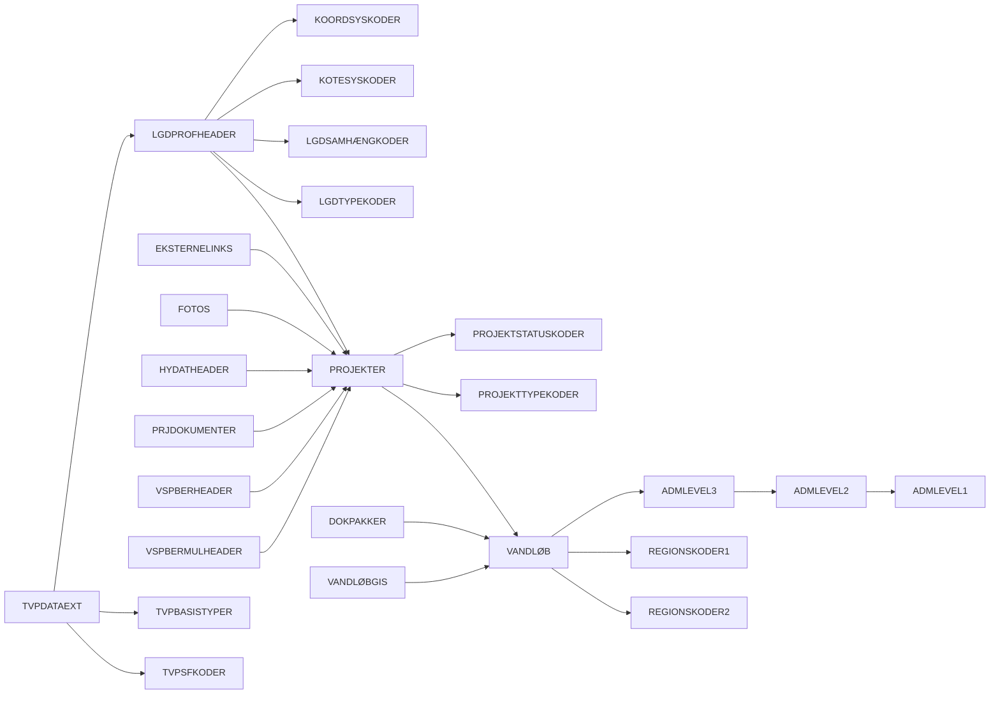

# VASP Access-database — Skema-dokumentation

> Kilde: `VASPdatabase_Dummykopi.mdb`  
> Genereret: 2026-06-08 via 32-bit OLEDB (Microsoft.ACE.OLEDB.12.0).  
> Antal brugertabeller: **27**. Antal fremmednøgle-kolonner: **24**.

## Indhold

1. [Oversigt](#1-oversigt)
2. [Relationsdiagram](#2-relationsdiagram)
3. [Tabeldetaljer](#3-tabeldetaljer)
4. [Alle relationer](#4-alle-relationer)

## 1. Oversigt

| Tabel | Rækker | Kolonner | Primærnøgle | Beskrivelse |
|-------|-------:|---------:|-------------|-------------|
| `ADMLEVEL1` | 9 | 6 | LEVEL1ID | Administrativt niveau 1 (øverste). Hierarki: 1→2→3. |
| `ADMLEVEL2` | 25 | 6 | LEVEL2ID | Administrativt niveau 2. Barn af ADMLEVEL1. |
| `ADMLEVEL3` | 178 | 6 | LEVEL3ID | Administrativt niveau 3. Barn af ADMLEVEL2. VANDLØB peger hertil. |
| `DBINI` | 3 | 3 | ASECTION, AENTRY | Database-initialisering/konfiguration (interne nøgleværdier). |
| `DOKPAKKER` | 0 | 8 | PKGID | Dokumentpakker pr. vandløb. |
| `EKSTERNELINKS` | 0 | 8 | EXTLINKID | Eksterne links pr. projekt. |
| `FOTOS` | 2 | 9 | DSID | Fotos pr. projekt. |
| `HYDATHEADER` | 226 | 13 | HYDATID | Hydrauliske data-headers pr. projekt. |
| `KOORDSYSKODER` | 3 | 2 | DDHKOORDSYSID | Opslag: koordinatsystemer (0=Ikke oplyst, 1=UTM32 ED50, 2=UTM32 EUREF89). |
| `KOTESYSKODER` | 3 | 3 | KOTESYSID | Opslag: kotesystemer (højdereferencer). |
| `LGDPROFHEADER` | 3441 | 25 | LGDID | Længdeprofil-headers (tværsnit/profiler) pr. projekt. Knytter koord-/kotesystem og profiltype. |
| `LGDSAMHÆNGKODER` | 6 | 2 | LGDSAMHÆNGID | Opslag: længdeprofil-sammenhænge. |
| `LGDTYPEKODER` | 4 | 2 | LGDTYPEID | Opslag: længdeprofiltyper. |
| `LOGOBMPS` | 5 | 4 | LOGOID | Lagrede logo-bitmaps (BLOB). |
| `PRJDOKUMENTER` | 53 | 9 | DOKID | Dokumenter pr. projekt. |
| `PROJEKTER` | 706 | 13 | PROJEKTID | Projekter knyttet til et vandløb. |
| `PROJEKTSTATUSKODER` | 4 | 2 | PROJEKTSTATUSID | Opslag: projektstatus. |
| `PROJEKTTYPEKODER` | 6 | 2 | PROJEKTTYPEID | Opslag: projekttyper. |
| `REGIONSKODER1` | 9 | 3 | REGIONSID1 | Opslag: regioner (primær), refereret af VANDLØB.REGIONSID1. |
| `REGIONSKODER2` | 1 | 3 | REGIONSID2 | Opslag: regioner (sekundær), refereret af VANDLØB.REGIONSID2. |
| `TVPBASISTYPER` | 6 | 3 | TVPTYPEKODE | Opslag: tværprofil-basistyper. |
| `TVPDATAEXT` | 387283 | 32 | TVPID | Tværprofil-/tværsnitsdata (stort: ~387k rækker). Barn af LGDPROFHEADER. |
| `TVPSFKODER` | 13 | 2 | TVPSFKODE | Opslag: tværprofil-SF-koder. |
| `VANDLØB` | 552 | 15 | VLBSYSID | Vandløbsstamdata — én række pr. vandløb. Central tabel. |
| `VANDLØBGIS` | 1559 | 18 | GISDATAID | Geometri (binær BLOB i GISDATA) og GIS-metadata. Flere versioner pr. vandløb. |
| `VSPBERHEADER` | 1012 | 24 | VSPBERID | VASP-beregnings-headers pr. projekt. |
| `VSPBERMULHEADER` | 206 | 22 | DSID | VASP-beregning multi-headers pr. projekt. |

## 2. Relationsdiagram

Pilen peger fra **barn (FK)** mod **forælder (PK)**.

## 3. Tabeldetaljer

### `ADMLEVEL1`

Administrativt niveau 1 (øverste). Hierarki: 1→2→3.

*Rækker: 9*

| # | Kolonne | Type | Null | Nøgle | Reference |
|--:|---------|------|:----:|-------|-----------|
| 1 | `LEVEL1ID` | COUNTER | nej | PK |  |
| 2 | `LEVEL0ID` | INTEGER | ja |  |  |
| 3 | `LEVEL1NAVN` | VARCHAR(80) | ja |  |  |
| 4 | `LEVELATT` | INTEGER | ja |  |  |
| 5 | `UPDDATE` | DATETIME | ja |  |  |
| 6 | `UPDINIT` | VARCHAR(10) | ja |  |  |

**Refereret af:** `ADMLEVEL2.LEVEL1ID`

### `ADMLEVEL2`

Administrativt niveau 2. Barn af ADMLEVEL1.

*Rækker: 25*

| # | Kolonne | Type | Null | Nøgle | Reference |
|--:|---------|------|:----:|-------|-----------|
| 1 | `LEVEL2ID` | COUNTER | nej | PK |  |
| 2 | `LEVEL1ID` | INTEGER | ja | FK | → `ADMLEVEL1.LEVEL1ID` |
| 3 | `LEVEL2NAVN` | VARCHAR(80) | ja |  |  |
| 4 | `LEVELATT` | INTEGER | ja |  |  |
| 5 | `UPDDATE` | DATETIME | ja |  |  |
| 6 | `UPDINIT` | VARCHAR(10) | ja |  |  |

**Refereret af:** `ADMLEVEL3.LEVEL2ID`

### `ADMLEVEL3`

Administrativt niveau 3. Barn af ADMLEVEL2. VANDLØB peger hertil.

*Rækker: 178*

| # | Kolonne | Type | Null | Nøgle | Reference |
|--:|---------|------|:----:|-------|-----------|
| 1 | `LEVEL3ID` | COUNTER | nej | PK |  |
| 2 | `LEVEL2ID` | INTEGER | ja | FK | → `ADMLEVEL2.LEVEL2ID` |
| 3 | `LEVEL3NAVN` | VARCHAR(80) | ja |  |  |
| 4 | `LEVELATT` | INTEGER | ja |  |  |
| 5 | `UPDDATE` | DATETIME | ja |  |  |
| 6 | `UPDINIT` | VARCHAR(10) | ja |  |  |

**Refereret af:** `VANDLØB.LEVEL3ID`

### `DBINI`

Database-initialisering/konfiguration (interne nøgleværdier).

*Rækker: 3*

| # | Kolonne | Type | Null | Nøgle | Reference |
|--:|---------|------|:----:|-------|-----------|
| 1 | `ASECTION` | VARCHAR(30) | ja | PK |  |
| 2 | `AENTRY` | VARCHAR(30) | ja | PK |  |
| 3 | `ARTN` | VARCHAR(100) | ja |  |  |

### `DOKPAKKER`

Dokumentpakker pr. vandløb.

*Rækker: 0*

| # | Kolonne | Type | Null | Nøgle | Reference |
|--:|---------|------|:----:|-------|-----------|
| 1 | `PKGID` | COUNTER | nej | PK |  |
| 2 | `VLBSYSID` | INTEGER | ja | FK | → `VANDLØB.VLBSYSID` |
| 3 | `PKGNAME` | VARCHAR(250) | ja |  |  |
| 4 | `GLOBID` | GUID | ja |  |  |
| 5 | `CREDATE` | DATETIME | ja |  |  |
| 6 | `CREINIT` | VARCHAR(10) | ja |  |  |
| 7 | `UPDDATE` | DATETIME | ja |  |  |
| 8 | `UPDINIT` | VARCHAR(10) | ja |  |  |

### `EKSTERNELINKS`

Eksterne links pr. projekt.

*Rækker: 0*

| # | Kolonne | Type | Null | Nøgle | Reference |
|--:|---------|------|:----:|-------|-----------|
| 1 | `EXTLINKID` | COUNTER | nej | PK |  |
| 2 | `PROJEKTID` | INTEGER | ja | FK | → `PROJEKTER.PROJEKTID` |
| 3 | `LINKTYPE` | INTEGER | ja |  |  |
| 4 | `NAVN` | VARCHAR(80) | ja |  |  |
| 5 | `FILREF` | VARCHAR(250) | ja |  |  |
| 6 | `PARAM1` | VARCHAR(80) | ja |  |  |
| 7 | `PARAM2` | VARCHAR(80) | ja |  |  |
| 8 | `PARAM3` | VARCHAR(80) | ja |  |  |

### `FOTOS`

Fotos pr. projekt.

*Rækker: 2*

| # | Kolonne | Type | Null | Nøgle | Reference |
|--:|---------|------|:----:|-------|-----------|
| 1 | `DSID` | COUNTER | nej | PK |  |
| 2 | `PROJEKTID` | INTEGER | ja | FK | → `PROJEKTER.PROJEKTID` |
| 3 | `NAVN` | VARCHAR(250) | ja |  |  |
| 4 | `SAGSNR` | VARCHAR(250) | ja |  |  |
| 5 | `SAGSBEHANDLER` | VARCHAR(120) | ja |  |  |
| 6 | `KUNDE` | VARCHAR(120) | ja |  |  |
| 7 | `BEMERKNING` | LONGCHAR(1073741823) | ja |  |  |
| 8 | `CREDATE` | DATETIME | ja |  |  |
| 9 | `UPDDATE` | DATETIME | ja |  |  |

### `HYDATHEADER`

Hydrauliske data-headers pr. projekt.

*Rækker: 226*

| # | Kolonne | Type | Null | Nøgle | Reference |
|--:|---------|------|:----:|-------|-----------|
| 1 | `HYDATID` | COUNTER | nej | PK |  |
| 2 | `PROJEKTID` | INTEGER | ja | FK | → `PROJEKTER.PROJEKTID` |
| 3 | `LOBENR` | VARCHAR(10) | ja |  |  |
| 4 | `NAVN` | VARCHAR(80) | ja |  |  |
| 5 | `BEMERKNING` | LONGCHAR(1073741823) | ja |  |  |
| 6 | `KOTESYSID` | INTEGER | ja |  |  |
| 7 | `GLOBID` | GUID | ja |  |  |
| 8 | `CREDATE` | DATETIME | ja |  |  |
| 9 | `CREINIT` | VARCHAR(10) | ja |  |  |
| 10 | `UPDDATE` | DATETIME | ja |  |  |
| 11 | `UPDINIT` | VARCHAR(10) | ja |  |  |
| 12 | `STMIN` | DOUBLE | ja |  |  |
| 13 | `STMAX` | DOUBLE | ja |  |  |

### `KOORDSYSKODER`

Opslag: koordinatsystemer (0=Ikke oplyst, 1=UTM32 ED50, 2=UTM32 EUREF89).

*Rækker: 3*

| # | Kolonne | Type | Null | Nøgle | Reference |
|--:|---------|------|:----:|-------|-----------|
| 1 | `DDHKOORDSYSID` | INTEGER | ja | PK |  |
| 2 | `NAVN` | VARCHAR(50) | ja |  |  |

**Refereret af:** `LGDPROFHEADER.KOORDSYSID`

### `KOTESYSKODER`

Opslag: kotesystemer (højdereferencer).

*Rækker: 3*

| # | Kolonne | Type | Null | Nøgle | Reference |
|--:|---------|------|:----:|-------|-----------|
| 1 | `KOTESYSID` | INTEGER | ja | PK |  |
| 2 | `NAVN` | VARCHAR(50) | ja |  |  |
| 3 | `DDHKOTESYSID` | INTEGER | ja |  |  |

**Refereret af:** `LGDPROFHEADER.KOTESYSID`

### `LGDPROFHEADER`

Længdeprofil-headers (tværsnit/profiler) pr. projekt. Knytter koord-/kotesystem og profiltype.

*Rækker: 3441*

| # | Kolonne | Type | Null | Nøgle | Reference |
|--:|---------|------|:----:|-------|-----------|
| 1 | `LGDID` | COUNTER | nej | PK |  |
| 2 | `PROJEKTID` | INTEGER | ja | FK | → `PROJEKTER.PROJEKTID` |
| 3 | `LØBENR` | INTEGER | ja |  |  |
| 4 | `NAVN` | VARCHAR(100) | ja |  |  |
| 5 | `BEMÆRKNING` | LONGCHAR(1073741823) | ja |  |  |
| 6 | `KOORDSYSID` | INTEGER | ja | FK | → `KOORDSYSKODER.DDHKOORDSYSID` |
| 7 | `KOTESYSID` | INTEGER | ja | FK | → `KOTESYSKODER.KOTESYSID` |
| 8 | `STATIONERINGSRETNING` | INTEGER | ja |  |  |
| 9 | `KILDEART` | INTEGER | ja |  |  |
| 10 | `KILDEDATA` | VARCHAR(250) | ja |  |  |
| 11 | `KILDEGLOBID` | GUID | ja |  |  |
| 12 | `LGDTYPEID` | INTEGER | ja | FK | → `LGDTYPEKODER.LGDTYPEID` |
| 13 | `LGDSAMHÆNGID` | INTEGER | ja | FK | → `LGDSAMHÆNGKODER.LGDSAMHÆNGID` |
| 14 | `EDITLOCK` | INTEGER | ja |  |  |
| 15 | `GEOCODETYPE` | INTEGER | ja |  |  |
| 16 | `GEOCODEGDSID` | INTEGER | ja |  |  |
| 17 | `GEOCODESTATUS` | INTEGER | ja |  |  |
| 18 | `GEOCODELINKLGD` | INTEGER | ja |  |  |
| 19 | `GLOBID` | GUID | ja |  |  |
| 20 | `CREDATE` | DATETIME | ja |  |  |
| 21 | `CREINIT` | VARCHAR(10) | ja |  |  |
| 22 | `UPDDATE` | DATETIME | ja |  |  |
| 23 | `UPDINIT` | VARCHAR(10) | ja |  |  |
| 24 | `STMIN` | DOUBLE | ja |  |  |
| 25 | `STMAX` | DOUBLE | ja |  |  |

**Refereret af:** `TVPDATAEXT.LGDID`

### `LGDSAMHÆNGKODER`

Opslag: længdeprofil-sammenhænge.

*Rækker: 6*

| # | Kolonne | Type | Null | Nøgle | Reference |
|--:|---------|------|:----:|-------|-----------|
| 1 | `LGDSAMHÆNGID` | INTEGER | ja | PK |  |
| 2 | `NAVN` | VARCHAR(50) | ja |  |  |

**Refereret af:** `LGDPROFHEADER.LGDSAMHÆNGID`

### `LGDTYPEKODER`

Opslag: længdeprofiltyper.

*Rækker: 4*

| # | Kolonne | Type | Null | Nøgle | Reference |
|--:|---------|------|:----:|-------|-----------|
| 1 | `LGDTYPEID` | INTEGER | ja | PK |  |
| 2 | `NAVN` | VARCHAR(50) | ja |  |  |

**Refereret af:** `LGDPROFHEADER.LGDTYPEID`

### `LOGOBMPS`

Lagrede logo-bitmaps (BLOB).

*Rækker: 5*

| # | Kolonne | Type | Null | Nøgle | Reference |
|--:|---------|------|:----:|-------|-----------|
| 1 | `LOGOID` | COUNTER | nej | PK |  |
| 2 | `LOGONAVNLANG` | VARCHAR(80) | ja |  |  |
| 3 | `LOGONAVNKORT` | VARCHAR(30) | ja |  |  |
| 4 | `LOGOBLOB` | LONGBINARY | ja |  |  |

### `PRJDOKUMENTER`

Dokumenter pr. projekt.

*Rækker: 53*

| # | Kolonne | Type | Null | Nøgle | Reference |
|--:|---------|------|:----:|-------|-----------|
| 1 | `DOKID` | COUNTER | nej | PK |  |
| 2 | `PROJEKTID` | INTEGER | ja | FK | → `PROJEKTER.PROJEKTID` |
| 3 | `DOKTYPE` | INTEGER | ja |  |  |
| 4 | `NAVN` | VARCHAR(250) | ja |  |  |
| 5 | `AUTODOKU` | LONGCHAR(1073741823) | ja |  |  |
| 6 | `OPSÆTNING` | LONGCHAR(1073741823) | ja |  |  |
| 7 | `GLOBID` | GUID | ja |  |  |
| 8 | `CREDATE` | DATETIME | ja |  |  |
| 9 | `CREINIT` | VARCHAR(10) | ja |  |  |

### `PROJEKTER`

Projekter knyttet til et vandløb.

*Rækker: 706*

| # | Kolonne | Type | Null | Nøgle | Reference |
|--:|---------|------|:----:|-------|-----------|
| 1 | `PROJEKTID` | COUNTER | nej | PK |  |
| 2 | `VLBSYSID` | INTEGER | ja | FK | → `VANDLØB.VLBSYSID` |
| 3 | `NAVN` | VARCHAR(80) | ja |  |  |
| 4 | `SAGSNR` | VARCHAR(80) | ja |  |  |
| 5 | `SAGSNAVN` | VARCHAR(80) | ja |  |  |
| 6 | `SAGSANSVARLIG` | VARCHAR(80) | ja |  |  |
| 7 | `BEMÆRKNING` | LONGCHAR(1073741823) | ja |  |  |
| 8 | `PROJEKTTYPEID` | INTEGER | nej | FK | → `PROJEKTTYPEKODER.PROJEKTTYPEID` |
| 9 | `PROJEKTSTATUSID` | INTEGER | ja | FK | → `PROJEKTSTATUSKODER.PROJEKTSTATUSID` |
| 10 | `CREDATE` | DATETIME | ja |  |  |
| 11 | `CREINIT` | VARCHAR(10) | ja |  |  |
| 12 | `UPDDATE` | DATETIME | ja |  |  |
| 13 | `UPDINIT` | VARCHAR(10) | ja |  |  |

**Refereret af:** `EKSTERNELINKS.PROJEKTID`, `FOTOS.PROJEKTID`, `HYDATHEADER.PROJEKTID`, `LGDPROFHEADER.PROJEKTID`, `PRJDOKUMENTER.PROJEKTID`, `VSPBERHEADER.PROJEKTID`, `VSPBERMULHEADER.PRJID`

### `PROJEKTSTATUSKODER`

Opslag: projektstatus.

*Rækker: 4*

| # | Kolonne | Type | Null | Nøgle | Reference |
|--:|---------|------|:----:|-------|-----------|
| 1 | `PROJEKTSTATUSID` | INTEGER | ja | PK |  |
| 2 | `NAVN` | VARCHAR(50) | ja |  |  |

**Refereret af:** `PROJEKTER.PROJEKTSTATUSID`

### `PROJEKTTYPEKODER`

Opslag: projekttyper.

*Rækker: 6*

| # | Kolonne | Type | Null | Nøgle | Reference |
|--:|---------|------|:----:|-------|-----------|
| 1 | `PROJEKTTYPEID` | INTEGER | ja | PK |  |
| 2 | `NAVN` | VARCHAR(50) | ja |  |  |

**Refereret af:** `PROJEKTER.PROJEKTTYPEID`

### `REGIONSKODER1`

Opslag: regioner (primær), refereret af VANDLØB.REGIONSID1.

*Rækker: 9*

| # | Kolonne | Type | Null | Nøgle | Reference |
|--:|---------|------|:----:|-------|-----------|
| 1 | `REGIONSID1` | INTEGER | ja | PK |  |
| 2 | `KORTNAVN` | VARCHAR(20) | ja |  |  |
| 3 | `LANGTNAVN` | VARCHAR(80) | ja |  |  |

**Refereret af:** `VANDLØB.REGIONSID1`

### `REGIONSKODER2`

Opslag: regioner (sekundær), refereret af VANDLØB.REGIONSID2.

*Rækker: 1*

| # | Kolonne | Type | Null | Nøgle | Reference |
|--:|---------|------|:----:|-------|-----------|
| 1 | `REGIONSID2` | INTEGER | ja | PK |  |
| 2 | `KORTNAVN` | VARCHAR(20) | ja |  |  |
| 3 | `LANGTNAVN` | VARCHAR(80) | ja |  |  |

**Refereret af:** `VANDLØB.REGIONSID2`

### `TVPBASISTYPER`

Opslag: tværprofil-basistyper.

*Rækker: 6*

| # | Kolonne | Type | Null | Nøgle | Reference |
|--:|---------|------|:----:|-------|-----------|
| 1 | `TVPTYPEKODE` | INTEGER | ja | PK |  |
| 2 | `NAVN` | VARCHAR(50) | ja |  |  |
| 3 | `INFOTABEL` | VARCHAR(50) | ja |  |  |

**Refereret af:** `TVPDATAEXT.TVPTYPEKODE`

### `TVPDATAEXT`

Tværprofil-/tværsnitsdata (stort: ~387k rækker). Barn af LGDPROFHEADER.

*Rækker: 387283*

| # | Kolonne | Type | Null | Nøgle | Reference |
|--:|---------|------|:----:|-------|-----------|
| 1 | `TVPID` | COUNTER | nej | PK |  |
| 2 | `LGDID` | INTEGER | ja | FK | → `LGDPROFHEADER.LGDID` |
| 3 | `STATION` | DOUBLE | ja |  |  |
| 4 | `KOORDX` | DOUBLE | ja |  |  |
| 5 | `KOORDY` | DOUBLE | ja |  |  |
| 6 | `ISTAT` | DOUBLE | ja |  |  |
| 7 | `DNNADDENT` | DOUBLE | ja |  |  |
| 8 | `BEMÆRKNING` | VARCHAR(100) | ja |  |  |
| 9 | `PLOTTEKST` | VARCHAR(80) | ja |  |  |
| 10 | `TVPTYPEKODE` | INTEGER | ja | FK | → `TVPBASISTYPER.TVPTYPEKODE` |
| 11 | `TVPSFKODE` | INTEGER | ja | FK | → `TVPSFKODER.TVPSFKODE` |
| 12 | `VSPSIGTEPLAN` | DOUBLE | ja |  |  |
| 13 | `VSPAFLÆSNING` | DOUBLE | ja |  |  |
| 14 | `VSPDATO` | DATETIME | ja |  |  |
| 15 | `ERKOTERET` | INTEGER | ja |  |  |
| 16 | `FIXPUNKTID` | INTEGER | ja |  |  |
| 17 | `SIDEKODE` | INTEGER | ja |  |  |
| 18 | `PARAM0` | DOUBLE | ja |  |  |
| 19 | `PARAM1` | DOUBLE | ja |  |  |
| 20 | `PARAM2` | DOUBLE | ja |  |  |
| 21 | `PARAM3` | DOUBLE | ja |  |  |
| 22 | `PARAM4` | DOUBLE | ja |  |  |
| 23 | `PARAM5` | DOUBLE | ja |  |  |
| 24 | `PARAM6` | DOUBLE | ja |  |  |
| 25 | `PARAM7` | DOUBLE | ja |  |  |
| 26 | `PARAM8` | DOUBLE | ja |  |  |
| 27 | `PARAM9` | DOUBLE | ja |  |  |
| 28 | `PARAM10` | DOUBLE | ja |  |  |
| 29 | `PARAM11` | DOUBLE | ja |  |  |
| 30 | `PARAM12` | DOUBLE | ja |  |  |
| 31 | `PARAM13` | DOUBLE | ja |  |  |
| 32 | `PKTDATA` | LONGBINARY | ja |  |  |

### `TVPSFKODER`

Opslag: tværprofil-SF-koder.

*Rækker: 13*

| # | Kolonne | Type | Null | Nøgle | Reference |
|--:|---------|------|:----:|-------|-----------|
| 1 | `TVPSFKODE` | INTEGER | ja | PK |  |
| 2 | `SFNAVN` | VARCHAR(50) | ja |  |  |

**Refereret af:** `TVPDATAEXT.TVPSFKODE`

### `VANDLØB`

Vandløbsstamdata — én række pr. vandløb. Central tabel.

*Rækker: 552*

| # | Kolonne | Type | Null | Nøgle | Reference |
|--:|---------|------|:----:|-------|-----------|
| 1 | `VLBSYSID` | COUNTER | nej | PK |  |
| 2 | `LEVEL3ID` | INTEGER | ja | FK | → `ADMLEVEL3.LEVEL3ID` |
| 3 | `NAVN` | VARCHAR(80) | ja |  |  |
| 4 | `VLBNR1` | VARCHAR(50) | ja |  |  |
| 5 | `VLBNR2` | VARCHAR(50) | ja |  |  |
| 6 | `REGIONSID1` | INTEGER | ja | FK | → `REGIONSKODER1.REGIONSID1` |
| 7 | `REGIONSID2` | INTEGER | ja | FK | → `REGIONSKODER2.REGIONSID2` |
| 8 | `BEMÆRKNING` | LONGCHAR(1073741823) | ja |  |  |
| 9 | `GLOBID` | GUID | ja |  |  |
| 10 | `CREDATE` | DATETIME | ja |  |  |
| 11 | `CREINIT` | VARCHAR(10) | ja |  |  |
| 12 | `UPDDATE` | DATETIME | ja |  |  |
| 13 | `UPDINIT` | VARCHAR(10) | ja |  |  |
| 14 | `FASTDNNADDENT` | DOUBLE | ja |  |  |
| 15 | `DNNMETODE` | INTEGER | ja |  |  |

**Refereret af:** `DOKPAKKER.VLBSYSID`, `PROJEKTER.VLBSYSID`, `VANDLØBGIS.VLBSYSID`

### `VANDLØBGIS`

Geometri (binær BLOB i GISDATA) og GIS-metadata. Flere versioner pr. vandløb.

*Rækker: 1559*

| # | Kolonne | Type | Null | Nøgle | Reference |
|--:|---------|------|:----:|-------|-----------|
| 1 | `GISDATAID` | COUNTER | nej | PK |  |
| 2 | `VLBSYSID` | INTEGER | ja | FK | → `VANDLØB.VLBSYSID` |
| 3 | `NAVN` | VARCHAR(80) | ja |  |  |
| 4 | `DATAGRUNDLAG` | VARCHAR(80) | ja |  |  |
| 5 | `GISDATA` | LONGBINARY | ja |  |  |
| 6 | `STATDATA` | LONGBINARY | ja |  |  |
| 7 | `DDHKOORDSYSID` | INTEGER | ja |  |  |
| 8 | `GYLDIGFRADATO` | DATETIME | ja |  |  |
| 9 | `GYLDIGTILDATO` | DATETIME | ja |  |  |
| 10 | `GLOBID` | GUID | ja |  |  |
| 11 | `CREDATE` | DATETIME | ja |  |  |
| 12 | `CREINIT` | VARCHAR(10) | ja |  |  |
| 13 | `UPDDATE` | DATETIME | ja |  |  |
| 14 | `UPDINIT` | VARCHAR(10) | ja |  |  |
| 15 | `DIGILÆNGDE` | DOUBLE | ja |  |  |
| 16 | `DNNADDENTMAX` | DOUBLE | ja |  |  |
| 17 | `DNNADDENTMIN` | DOUBLE | ja |  |  |
| 18 | `DNNADDENTMID` | DOUBLE | ja |  |  |

### `VSPBERHEADER`

VASP-beregnings-headers pr. projekt.

*Rækker: 1012*

| # | Kolonne | Type | Null | Nøgle | Reference |
|--:|---------|------|:----:|-------|-----------|
| 1 | `VSPBERID` | COUNTER | nej | PK |  |
| 2 | `PROJEKTID` | INTEGER | ja | FK | → `PROJEKTER.PROJEKTID` |
| 3 | `LOBENR` | VARCHAR(10) | ja |  |  |
| 4 | `NAVN` | VARCHAR(250) | ja |  |  |
| 5 | `BEMERKNING` | LONGCHAR(1073741823) | ja |  |  |
| 6 | `LGDID` | INTEGER | ja |  |  |
| 7 | `LGDUPDDATE` | DATETIME | ja |  |  |
| 8 | `HYDATID` | INTEGER | ja |  |  |
| 9 | `HYDATUPDDATE` | DATETIME | ja |  |  |
| 10 | `CALCSTATUS` | INTEGER | ja |  |  |
| 11 | `CALCDATE` | DATETIME | ja |  |  |
| 12 | `CALCINIT` | VARCHAR(10) | ja |  |  |
| 13 | `CALCSTMIN` | DOUBLE | ja |  |  |
| 14 | `CALCSTMAX` | DOUBLE | ja |  |  |
| 15 | `KOORDSYSID` | INTEGER | ja |  |  |
| 16 | `KOTESYSID` | INTEGER | ja |  |  |
| 17 | `GEOCODEGDSID` | INTEGER | ja |  |  |
| 18 | `GEOCODELINKLGD` | INTEGER | ja |  |  |
| 19 | `GEOCODESTATUS` | INTEGER | ja |  |  |
| 20 | `GLOBID` | GUID | ja |  |  |
| 21 | `CREDATE` | DATETIME | ja |  |  |
| 22 | `CREINIT` | VARCHAR(10) | ja |  |  |
| 23 | `UPDDATE` | DATETIME | ja |  |  |
| 24 | `UPDINIT` | VARCHAR(10) | ja |  |  |

### `VSPBERMULHEADER`

VASP-beregning multi-headers pr. projekt.

*Rækker: 206*

| # | Kolonne | Type | Null | Nøgle | Reference |
|--:|---------|------|:----:|-------|-----------|
| 1 | `DSID` | COUNTER | nej | PK |  |
| 2 | `PRJID` | INTEGER | ja | FK | → `PROJEKTER.PROJEKTID` |
| 3 | `DSTYPE` | INTEGER | ja |  |  |
| 4 | `NAVN` | VARCHAR(120) | ja |  |  |
| 5 | `LOBENR` | VARCHAR(10) | ja |  |  |
| 6 | `BEM` | LONGCHAR(1073741823) | ja |  |  |
| 7 | `BERTYPEID` | INTEGER | ja |  |  |
| 8 | `BERSAMHENGID` | INTEGER | ja |  |  |
| 9 | `KONTROLFRA` | DATETIME | ja |  |  |
| 10 | `STMIN` | DOUBLE | ja |  |  |
| 11 | `STMAX` | DOUBLE | ja |  |  |
| 12 | `CALCSTATE` | INTEGER | ja |  |  |
| 13 | `GEOSTATE` | INTEGER | ja |  |  |
| 14 | `RESKOTESYS` | INTEGER | ja |  |  |
| 15 | `GLOBID` | GUID | ja |  |  |
| 16 | `CREDATE` | DATETIME | ja |  |  |
| 17 | `CREINIT` | VARCHAR(10) | ja |  |  |
| 18 | `UPDDATE` | DATETIME | ja |  |  |
| 19 | `UPDINIT` | VARCHAR(10) | ja |  |  |
| 20 | `LGDREF` | INTEGER | ja |  |  |
| 21 | `HYDREF` | INTEGER | ja |  |  |
| 22 | `GISREF` | INTEGER | ja |  |  |

## 4. Alle relationer

| Barn (FK) | → | Forælder (PK) |
|-----------|---|---------------|
| `ADMLEVEL2.LEVEL1ID` | → | `ADMLEVEL1.LEVEL1ID` |
| `ADMLEVEL3.LEVEL2ID` | → | `ADMLEVEL2.LEVEL2ID` |
| `VANDLØB.LEVEL3ID` | → | `ADMLEVEL3.LEVEL3ID` |
| `LGDPROFHEADER.KOORDSYSID` | → | `KOORDSYSKODER.DDHKOORDSYSID` |
| `LGDPROFHEADER.KOTESYSID` | → | `KOTESYSKODER.KOTESYSID` |
| `TVPDATAEXT.LGDID` | → | `LGDPROFHEADER.LGDID` |
| `LGDPROFHEADER.LGDSAMHÆNGID` | → | `LGDSAMHÆNGKODER.LGDSAMHÆNGID` |
| `LGDPROFHEADER.LGDTYPEID` | → | `LGDTYPEKODER.LGDTYPEID` |
| `EKSTERNELINKS.PROJEKTID` | → | `PROJEKTER.PROJEKTID` |
| `FOTOS.PROJEKTID` | → | `PROJEKTER.PROJEKTID` |
| `HYDATHEADER.PROJEKTID` | → | `PROJEKTER.PROJEKTID` |
| `LGDPROFHEADER.PROJEKTID` | → | `PROJEKTER.PROJEKTID` |
| `PRJDOKUMENTER.PROJEKTID` | → | `PROJEKTER.PROJEKTID` |
| `VSPBERHEADER.PROJEKTID` | → | `PROJEKTER.PROJEKTID` |
| `VSPBERMULHEADER.PRJID` | → | `PROJEKTER.PROJEKTID` |
| `PROJEKTER.PROJEKTSTATUSID` | → | `PROJEKTSTATUSKODER.PROJEKTSTATUSID` |
| `PROJEKTER.PROJEKTTYPEID` | → | `PROJEKTTYPEKODER.PROJEKTTYPEID` |
| `VANDLØB.REGIONSID1` | → | `REGIONSKODER1.REGIONSID1` |
| `VANDLØB.REGIONSID2` | → | `REGIONSKODER2.REGIONSID2` |
| `TVPDATAEXT.TVPTYPEKODE` | → | `TVPBASISTYPER.TVPTYPEKODE` |
| `TVPDATAEXT.TVPSFKODE` | → | `TVPSFKODER.TVPSFKODE` |
| `DOKPAKKER.VLBSYSID` | → | `VANDLØB.VLBSYSID` |
| `PROJEKTER.VLBSYSID` | → | `VANDLØB.VLBSYSID` |
| `VANDLØBGIS.VLBSYSID` | → | `VANDLØB.VLBSYSID` |

> Bemærk: BLOB-feltet `VANDLØBGIS.GISDATA` indeholder geometri i et proprietært
> binært format (int32 punktantal + N×4×float64: X, Y, stationering, M; CRS via
> `DDHKOORDSYSID`). Se `docs/architecture.md` §2.5 for dekodning.